# SoulRise Panchang - Technical Stack & System Architecture Document

> **App Identifier**: `com.soulrise.panchang`  
> **Platform**: Cross-Platform Mobile (Android & iOS)  
> **Target SDK**: Android 14 (API 34) | Minimum SDK: Android 6.0 (API 23)  
> **Primary Technology**: React Native + Expo Managed/Bare Architecture  

---

## 1. Executive Summary

**SoulRise Panchang** is a high-precision, authentic Vedic Astrology, Hindu Panchang, and Jain Calendar mobile application built with React Native and TypeScript. The application combines astronomical calculation algorithms with intuitive UI visualizations (including 2D Lagna Kundali charts, 28-Nakshatra Kota Fortress charts, Navtara matrices, and Pachkhan fasting managers).

---

## 2. Technical Stack Overview

| Layer | Component / Library | Version | Purpose & Usage |
| :--- | :--- | :--- | :--- |
| **Framework** | React Native | `0.74.5` | Cross-platform UI architecture |
| **Ecosystem** | Expo | `~51.0.0` | Native runtime modules & CLI tools |
| **Language** | TypeScript | `^5.1.3` | Type safety, data models & zero-error compilation |
| **JS Engine** | Hermes Engine | Metro v0.80+ | High-performance AOT compiled JS runtime |
| **Graphics** | React Native SVG | `15.2.0` | Native 2D SVG Lagna Kundali & Kota Chakra fort rendering |
| **Storage** | Async Storage | `1.23.1` | Offline profile & birth chart persistence |
| **Auth** | Google Sign-In | `16.1.5` | OAuth2 user login & cloud profile backup |
| **Location** | Expo Location | `~17.0.1` | GPS location lookup for astronomical calculations |
| **Notifications**| Expo Notifications | `~0.28.19` | Local push alerts for Pachkhan vows & Rahu Kalam |
| **Safe Insets** | Safe Area Context | `4.10.5` | Edge-to-edge notch & navigation bar handling |

---

## 3. Core System Architecture

```mermaid
graph TD
    A["User Interface (React Native Views & Modals)"] --> B["Language Context (i18n: EN / HI / GU)"]
    A --> C["React Native SVG Renderers"]
    
    subgraph "Astronomical & Vedic Calculation Engines"
        D["panchangEngine.ts (5 Limbs & Tithis)"]
        E["kundaliEngine.ts (Ephemeris & D9 Navamsha)"]
        F["kotaChakraEngine.ts (28-Nakshatra Fort & Insights)"]
        G["navtaraEngine.ts (9-Tara Matrix)"]
        H["jainCalendarEngine.ts (VNS Calendar & Pachkhan)"]
        I["muhuratCalculator.ts (Choghadiya & Rahu Kalam)"]
    end
    
    A --> D
    A --> E
    A --> F
    A --> G
    A --> H
    A --> I
    
    subgraph "Native Storage & Integrations"
        J["@react-native-async-storage/async-storage"]
        K["@react-native-google-signin/google-signin"]
        L["expo-location (GPS Geocoding)"]
        M["expo-notifications (Local Alarms)"]
    end
    
    A --> J
    A --> K
    A --> L
    A --> M
```



---

## 4. Custom Calculation & Astrology Engines

### 🌌 A. Panchang & Ephemeris Engine (`panchangEngine.ts`)
- Computes the **5 Limbs of Panchang**: Tithi, Vara (Weekday), Nakshatra, Yoga, and Karana.
- Determines exact local **Sunrise, Sunset, Moonrise, and Moonset** times based on GPS coordinates.
- Calculates **Vikram Samvat** and **Shaka Samvat** era years, Ayana (Uttarayana/Dakshinayana), and Ritu (Seasons).

### 🪐 B. Kundali & Ephemeris Engine (`kundaliEngine.ts`)
- Calculates exact planetary longitudes for 9 Planets (Sun, Moon, Mars, Mercury, Jupiter, Venus, Saturn, Rahu, Ketu) + Ascendant (Lagna).
- Constructs the **12-House Lagna Kundali** chart with Nakshatra Padas and **Navamsha (D9)** divisional chart.
- Computes **Vimshottari Mahadasha & Antardasha** timeline calculations.

### 🏰 C. Authentic 28-Nakshatra Kota Fortress Engine (`kotaChakraEngine.ts`)
- Implements the authentic **28-Nakshatra System** (including Abhijit at #22).
- Maps planets into 4 Concentric Fort Zones:
  1. **Stambha** (Central Core Pillar)
  2. **Madhya / Durgantara** (Inner Fort Ring)
  3. **Prakara** (Outer Fort Defense Wall)
  4. **BAHYA** (External Boundary)
- Anchors Nakshatra numbering `#1..28` to the user's **Janma Nakshatra**.
- Computes **Kota Swami** (Moon sign lord) & **Kota Pala** (Janma Nakshatra lord).
- **Deep Life Event Transit Insights Engine**: Automated rules evaluating planetary transit afflictions affecting Mind, Career, and Mother's Health (*Matru-karaka*), including **Chandra-Ketu Grahan** alerts.

### 🌟 D. Navtara Matrix Engine (`navtaraEngine.ts`)
- Maps natal and transit planets across the 9 Tara categories:
  - **Janma** (Birth), **Sampat** (Wealth), **Vipat** (Danger), **Kshema** (Well-being), **Pratyak** (Obstacles), **Sadhak** (Achievement), **Vadha** (Destruction), **Mitra** (Friend), and **Ati-Mitra** (Great Friend).

### ☸️ E. Jain Vira Nirvana Samvat Engine (`jainCalendarEngine.ts`)
- Computes **Vira Nirvana Samvat (VNS)** years (e.g. 2026 CE = VNS 2552).
- Tracks **Pachkhan Fasting Vows**: Navkarsi, Porsi, Sad-Porsi, Purimattam, Avadh, Chauvihar.
- Accurately computes sacred Parva tithis (*Aastham, Chaudas, Pancham*) and major Jain festivals including **Shwetambar Paryushan & Samvatsari (Michhami Dukkadam)** and **Digambar Dashalakshana & Kshamavani**.

---

## 5. Native Android Build Specification

```groovy
android {
    compileSdk 34
    defaultConfig {
        applicationId 'com.soulrise.panchang'
        minSdkVersion 23
        targetSdkVersion 34
        versionCode 9
        versionName "1.0.8"
    }
    buildTypes {
        release {
            minifyEnabled false
            signingConfig signingConfigs.release
        }
    }
}
```

---

## 6. Internationalization (i18n)

The application features a custom, lightweight `LanguageContext` architecture providing instant, zero-reboot translation across:
- **English (`en`)**
- **Hindi (`hi`)**
- **Gujarati (`gu`)**

All planetary terms, tithi descriptions, Pachkhan mantras, and deep transit insights render dynamically based on the user's active language preference.
